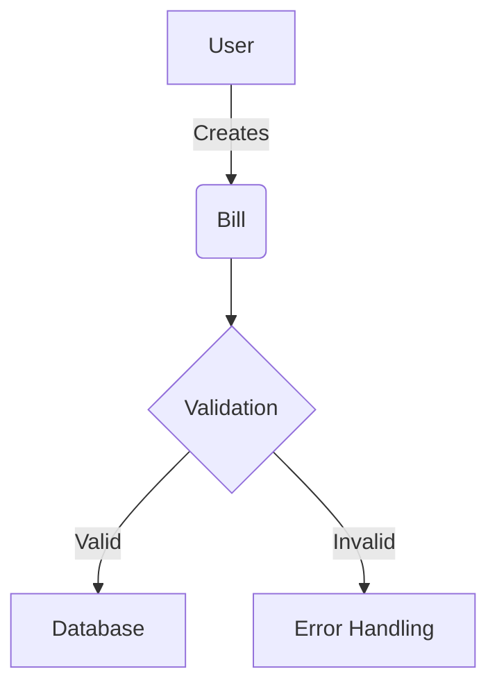
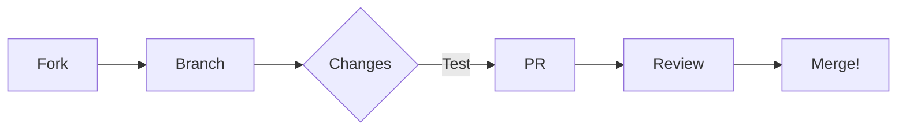

````markdown
# <span style="color: #FF6B6B; text-shadow: 2px 2px 4px rgba(0,0,0,0.2);">A</span><span style="color: #4ECDC4;">A</span><span style="color: #45B7D1;">S</span><span style="color: #96CEB4;">P</span><span style="color: #FFEEAD;">O</span><span style="color: #FF9999;">S</span> 🚀


> **Modern Expense Management Dashboard**  
> *Where Financial Clarity Meets Elegant Design*

[](https://opensource.org/licenses/MIT)


## ✨ **Key Features**  
<p align="center">
  
</p>

- 🕒 **Real-Time Expense Tracking**  
- 📱 **Fully Responsive Interface**  
- 🛡 **Secure API Integration**  
- 🧩 **Modular Component Architecture**  
- 💳 **Smart Billing Solutions**  
- 👥 **User Management Portal**  

---

## 🎬 Live Preview

[](./assets/preview.mp4)

> 🎥 **Click the image above to watch a short video of AASPOS in action.**

---

## 🚀 **Getting Started**

### 📋 **Prerequisites**
```bash
Node.js >= 18.x
npm >= 9.x
````

### ⚡ **Quick Installation**

```bash
git clone https://github.com/your-username/AASPOS.git
cd AASPOS
npm install
npm start
```

---

## 🎨 **Feature Highlights**

<details>
<summary><strong>📈 Real-Time Dashboard</strong></summary>


```jsx
// Example of data fetching
useEffect(() => {
  axios.get('/api/expenses')
    .then(response => setExpenses(response.data))
    .catch(error => handleError(error));
}, []);
```

</details>

<details>
<summary><strong>💳 Intelligent Billing System</strong></summary>



</details>

---

## 🖼 **Visual Journey**

| Feature          | Preview                                                                        |
| ---------------- | ------------------------------------------------------------------------------ |
| Expense Overview |      |
| Billing System   |  |
| User Management  |       |

---

## 🌟 **Why Choose AASPOS?**

<div align="center">

**"Transform Your Financial Management"** 💼

| Speed       | Security     | Simplicity   |
| ----------- | ------------ | ------------ |
| ⚡ Real-time | 🔒 Encrypted | 🧩 Intuitive |
| 🚀 Fast API | 🛡 Protected | 🎯 Precise   |

</div>

---

## 🤝 **Contribution Station**



---

## 📜 **License**

```text
MIT License © 2024 Your Name

Permission is hereby granted... (see LICENSE for full text)
```


