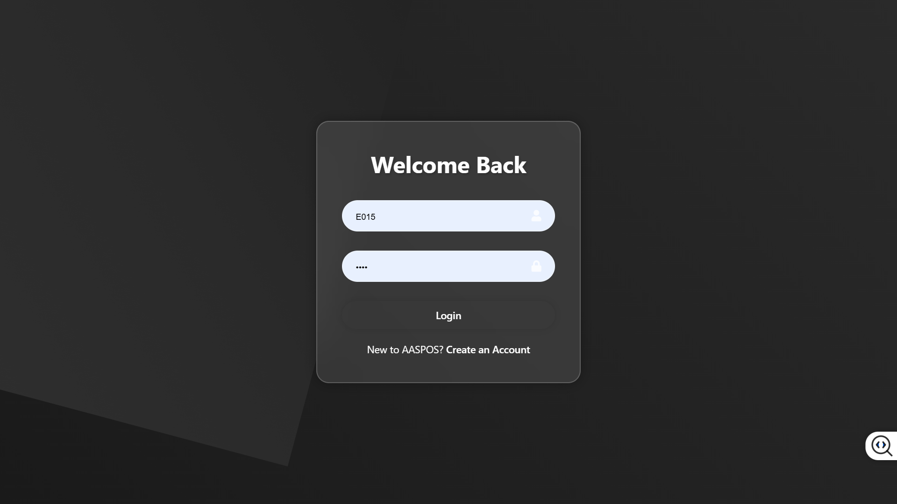
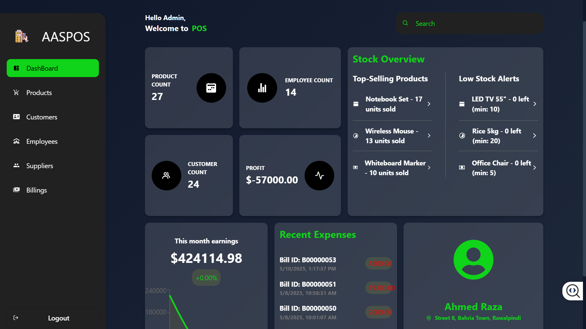
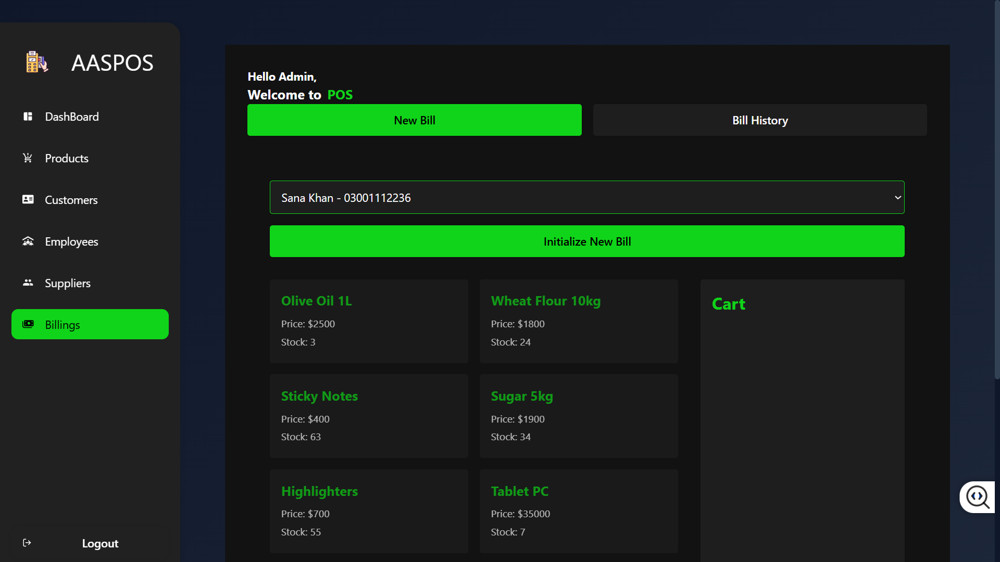
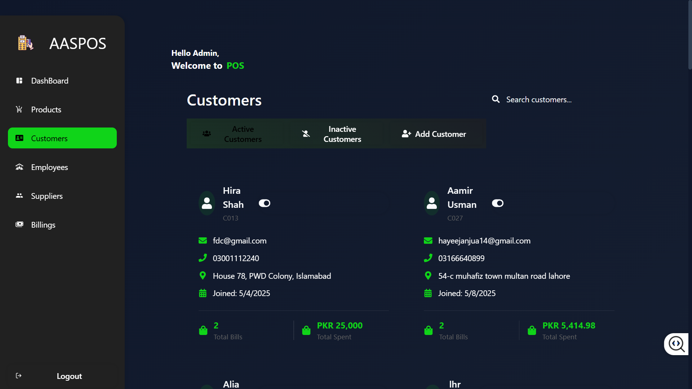
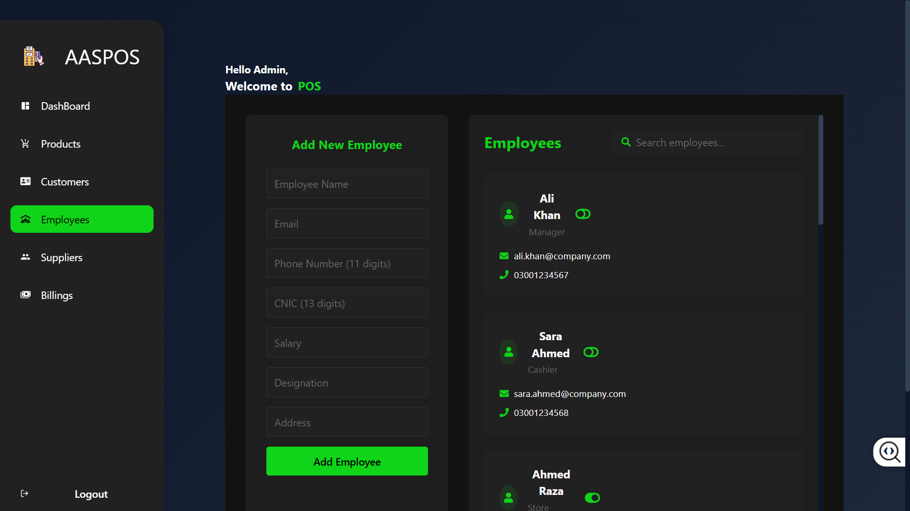

<div align="center" style="
    background: linear-gradient(135deg, #1a1a2e 0%, #16213e 50%, #0f3460 100%);
    padding: 2.5rem 1rem;
    border-radius: 15px;
    box-shadow: 0 10px 30px rgba(0,0,0,0.4);
    margin: 2rem 0;
    border: 2px solid #2a9df4;
">
    <h1 style="
        font-family: 'Arial Black', sans-serif;
        font-size: 3.5rem;
        background: linear-gradient(45deg, #00b4d8 0%, #90e0ef 100%);
        -webkit-background-clip: text;
        background-clip: text;
        color: transparent;
        text-shadow: 0 0 15px rgba(144,224,239,0.5);
        letter-spacing: 2px;
        margin: 0;
    ">
        
 ░▒▓██████▓▒░ ░▒▓██████▓▒░ ░▒▓███████▓▒░▒▓███████▓▒░ ░▒▓██████▓▒░ ░▒▓███████▓▒░ 
░▒▓█▓▒░░▒▓█▓▒░▒▓█▓▒░░▒▓█▓▒░▒▓█▓▒░      ░▒▓█▓▒░░▒▓█▓▒░▒▓█▓▒░░▒▓█▓▒░▒▓█▓▒░        
░▒▓█▓▒░░▒▓█▓▒░▒▓█▓▒░░▒▓█▓▒░▒▓█▓▒░      ░▒▓█▓▒░░▒▓█▓▒░▒▓█▓▒░░▒▓█▓▒░▒▓█▓▒░        
░▒▓████████▓▒░▒▓████████▓▒░░▒▓██████▓▒░░▒▓███████▓▒░░▒▓█▓▒░░▒▓█▓▒░░▒▓██████▓▒░  
░▒▓█▓▒░░▒▓█▓▒░▒▓█▓▒░░▒▓█▓▒░      ░▒▓█▓▒░▒▓█▓▒░      ░▒▓█▓▒░░▒▓█▓▒░      ░▒▓█▓▒░ 
░▒▓█▓▒░░▒▓█▓▒░▒▓█▓▒░░▒▓█▓▒░      ░▒▓█▓▒░▒▓█▓▒░      ░▒▓█▓▒░░▒▓█▓▒░      ░▒▓█▓▒░ 
░▒▓█▓▒░░▒▓█▓▒░▒▓█▓▒░░▒▓█▓▒░▒▓███████▓▒░░▒▓█▓▒░       ░▒▓██████▓▒░░▒▓███████▓▒░  
                                                                                
                                                                                

    </h1>
    <p style="
        color: #caf0f8;
        font-size: 1.2rem;
        margin-top: 1rem;
        font-weight: 300;
        letter-spacing: 1.5px;
    ">
        Advanced Analytics Sales Point-of-Sale System
    </p>
</div>

# 📊 AASPOS

---

  
**A modern web dashboard for expense management with real-time updates and role-based access.**

---

## 📖 Description  
A responsive React-based dashboard integrated with a Node.js backend and SQL Server, designed to streamline expense tracking, customer management, and business analytics. Built with `styled-components` for a polished UI and secured via JWT authentication.

---

## 🗂️ Sidebar Views & Features

### 🔐 **Login**  
 *Secure gateway to the dashboard*  
- **Features:**  
  - 🔒 JWT User authentication & role-based access  
  - 🕒 "Remember Me" functionality  

---

### 📊 **Dashboard**  
 *Your financial overview at a glance*  
- **Features:**  
  - 📍 Real-time expense tracking  
  - 🚀 Quick-action shortcuts  
  - 📋 Recent transactions summary  
  - 📉 Interactive financial charts  
  - 📊 Custom report generation  
  - 🔍 Trend analysis tools  

---

### 💰 **Billing**  
 *End-to-end billing solutions*  
- **Features:**  
  - 🧾 Invoice generation & management  
  - 📆 Billing history archive  

---

### 👥 **Customers**  
 *Centralized client profiles*  
- **Features:**  
  - 📇 Detailed customer profiles  
  - ⏳ Transaction history timeline  
  - 📞 Contact management hub  

---

### 👨‍💼 **Employees**  
 *Team management made simple*  
- **Features:**  
  - 👤 Employee role management  
  - 📊 Performance analytics  

---

## ✨ Key Features  
- 🌐 **Real-Time Sync**: Instant data updates across devices  
- 📱 **Mobile-First Design**: Flawless on all screen sizes  
- 🔐 **Bank-Grade Security**: JWT encryption & RBAC  
- 🎨 **Theming**: Customizable color schemes  

---

## 🛠️ Technical Stack  
  
  
  
  

**Architecture**: RESTful API with Express.js  
**Styling**: `styled-components` + CSS Grid/Flexbox  
**State Management**: React Context API  

---

## 🚀 Installation  
1. Clone the repo:  
   ```bash
   git clone https://github.com/your-username/expense-dashboard.git
   ```
2. Install dependencies:  
   ```bash
   cd backend && cd frontend && npm install
   ```
3. Start the app:  
   ```bash
   npm run dev
   ```
4. Open in browser:  
   ```bash
   http://localhost:3001
   ```

---

## 🤝 Contributing  
PRs welcome! Please:  
1. Fork the repository  
2. Create a feature branch (`git checkout -b feature/amazing-feature`)  
3. Commit changes  
4. Push to branch  
5. Open a PR  

---

## 📜 License  
Distributed under the MIT License. See `LICENSE` for details.  

---

*Crafted with ❤️ by [ABDUL AHAD]*  

---
